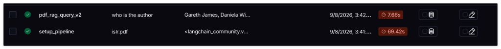
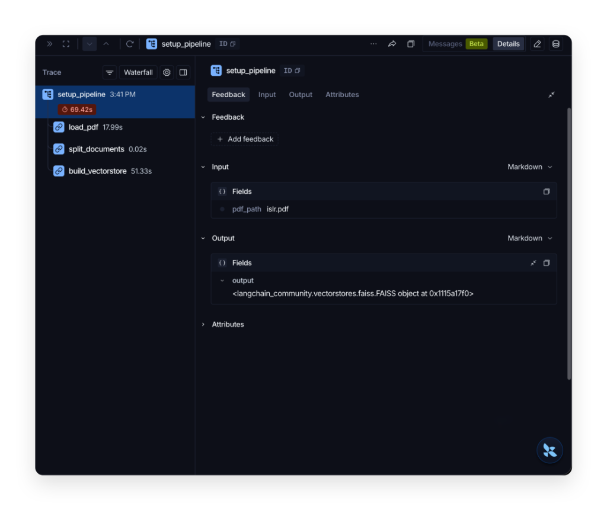
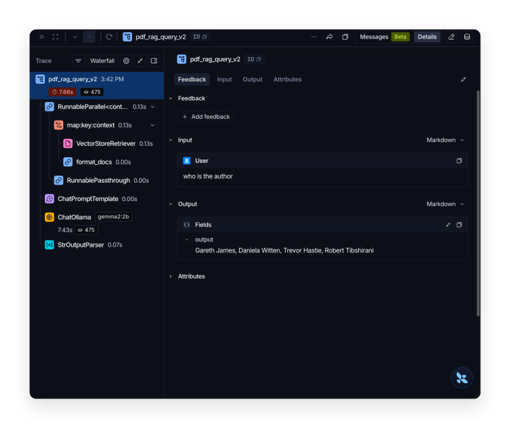
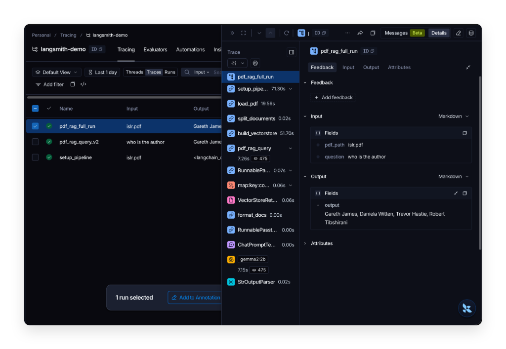
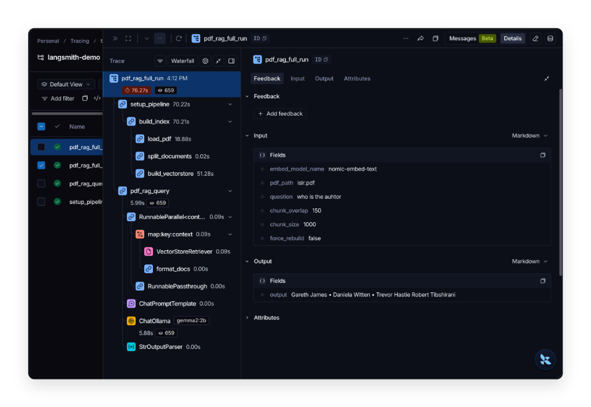
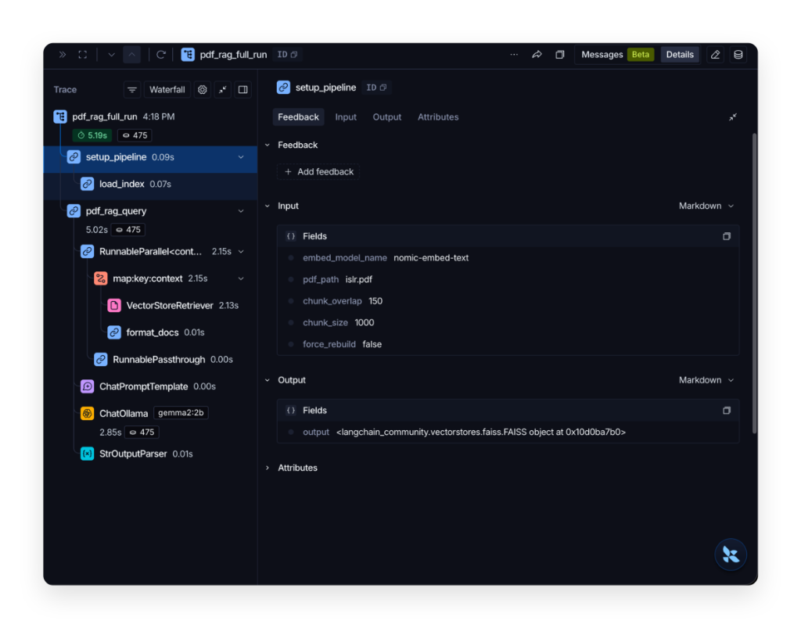
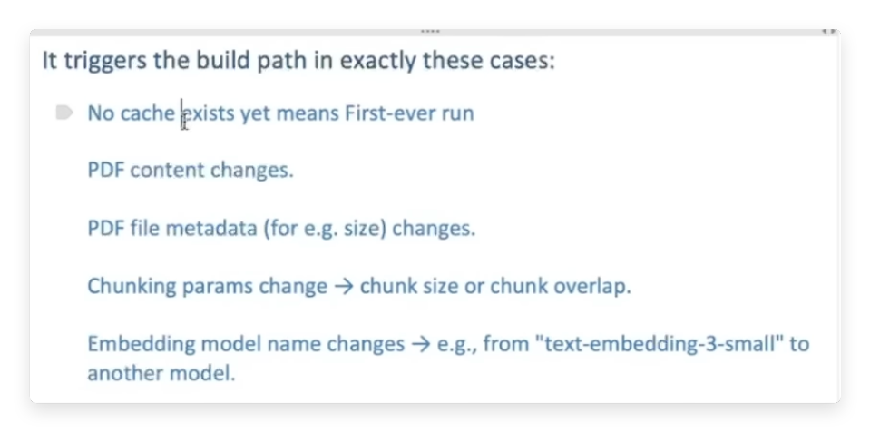
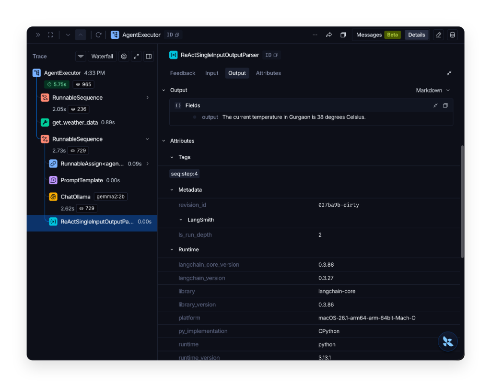

# Learning notes

## Key LangSmith Terminology & Environment Setup

### Core Terminology

- **Trace**: A complete execution tree (parent-child hierarchy) representing a single end-to-end request or process run.
- **Run**: A single unit of execution within a trace (e.g., an LLM invocation, vector store retrieval, prompt template, or `@traceable` function).
- **Project**: A logical workspace/container in LangSmith used to aggregate, filter, and analyze related traces.
- **Run Name (`run_name`)**: A custom, human-readable identifier assigned to a run/chain to replace generic names in the dashboard.
- **Tags & Metadata**: Categorical labels (`tags`) and structured key-value context (`metadata`) attached to runs for searching and filtering.

### Dynamic Configuration via `os.environ`

LangSmith tracing and project settings can be configured via `.env` or set dynamically in Python using `os.environ`:

```python
import os

# Enable LangSmith tracing
os.environ["LANGCHAIN_TRACING_V2"] = "true"
os.environ["LANGCHAIN_API_KEY"] = "your-api-key"

# Change project name dynamically in code
os.environ["LANGCHAIN_PROJECT"] = "pdf_rag_demo"
```

Updating `os.environ["LANGCHAIN_PROJECT"]` dynamically changes which project board in the LangSmith dashboard receives the execution traces.

## Completed

### Lesson 1 — simple LLM call

The basic LangChain Expression Language flow is:

```text
PromptTemplate → ChatOllama → StrOutputParser
```

`ChatOllama(model="gemma2:2b")` runs the model locally through Ollama. No OpenAI API key is needed for this lesson.

### Lesson 2 — sequential chain

The chain runs two model calls in sequence:

```text
prompt1 → model → parser → {"text": ...} → prompt2 → model → parser
```

The `RunnableLambda` conversion is intentional. `StrOutputParser` returns a string, while `prompt2` expects a dictionary containing its `text` variable. Making that conversion explicit prevents the Zed/Pyright type error:

```python
def to_summary_input(text: str) -> dict[str, str]:
    return {"text": text}
```

## LangSmith run configuration

LangChain and LangGraph accept a `config` object when invoking a chain or workflow. This is useful for organizing and filtering runs in LangSmith:

```python
from langchain_core.runnables import RunnableConfig

run_config: RunnableConfig = {
    "run_name": "evaluate_upsc_essay",
    "tags": ["essay", "langgraph", "evaluation"],
    "metadata": {
        "model": "gemma2:2b",
        "dimensions": ["language", "analysis", "clarity"],
    },
}

result = workflow.invoke({"essay": essay}, config=run_config)
```

`run_name` gives the run a readable name. `tags` are searchable labels for grouping runs. `metadata` stores extra key-value information such as the model, document name, question, or configuration used for the run.

Use `RunnableConfig` as the type annotation when the editor reports that an inline config dictionary is incompatible with `invoke`. It makes the expected LangChain config shape explicit while preserving the tags and metadata in the LangSmith trace.

## Pending lessons

### Lesson 3 — RAG

Next, understand the full retrieval flow:

1. Load the PDF.
2. Split it into chunks.
3. Create local embeddings with `nomic-embed-text`.
4. Store and search vectors with FAISS.
5. Pass retrieved context to Gemma.
6. Compare the tracing and caching improvements across `v1`–`v4`.

The embedding model is separate from Gemma because chat models generate text, while embedding models convert text into vectors for similarity search.

#### Tracing behavior in `3_rag_v1.py`

In v1, LangSmith automatically logs the runnables that are part of the LangChain chain, such as the retriever, prompt, Ollama model, and output parser. The PDF loader, chunker/splitter, embedding setup, and FAISS index construction happen before the chain is invoked, so they are not individually logged as LangSmith runs. Later versions add explicit `@traceable` wrappers around setup and preprocessing steps so those components appear in the trace.

#### How `3_rag_v2.py` improves this

V2 makes the preprocessing steps visible by decorating regular Python functions with LangSmith's `@traceable` decorator, including `tags` and `metadata`:

```python
@traceable(name="load_pdf", tags=["pdf", "loader"], metadata={"loader": "PyPDFLoader"})
def load_pdf(path):
    ...

@traceable(
    name="split_documents",
    tags=["splitter"],
    metadata={"splitter": "RecursiveCharacterTextSplitter"},
)
def split_documents(docs):
    ...

@traceable(
    name="build_vectorstore",
    tags=["vectorstore"],
    metadata={"vectorstore": "FAISS"},
)
def build_vectorstore(splits):
    ...
```

It then groups those steps under a parent setup run:

```python
@traceable(name="setup_pipeline")
def setup_pipeline(pdf_path):
    docs = load_pdf(pdf_path)
    splits = split_documents(docs)
    return build_vectorstore(splits)
```

This gives LangSmith a nested trace: `setup_pipeline` contains the PDF loading, splitting, and vectorstore-building child runs. In `build_vectorstore`, document embeddings are generated in batches of 32 (`range(0, len(texts), 32)`).

V2 also names the actual question-answering run using `config: RunnableConfig = {"run_name": "pdf_rag_query_v2"}`.

### What `run_name` does

- **Overrides Default Labels**: Replaces generic names like `RunnableSequence` or `Chain` in the LangSmith UI with a custom, descriptive title (e.g., `pdf_rag_query_v2`).
- **Simplifies Filtering & Dashboard Search**: Allows filtering traces in LangSmith by specific experiment or run names.
- **Differentiates Runs**: Makes it easy to distinguish between setup tasks (`setup_pipeline`) and individual query executions (`pdf_rag_query_v2`) in trace lists.

#### LangSmith Traces for `3_rag_v2.py`

**1. Separated Run List in LangSmith Dashboard:**
`setup_pipeline` and `pdf_rag_query_v2` appear as distinct, top-level runs:



**2. Detailed Setup Pipeline Trace (`setup_pipeline`):**
Shows the nested execution tree of `@traceable` functions (`load_pdf` → `split_documents` → `build_vectorstore`):



**3. Detailed Query Trace (`pdf_rag_query_v2`):**
Shows the execution tree of the retrieval parallel step, prompt template, Ollama model call, and output parser:



#### Unified End-to-End Trace in `3_rag_v3.py`

In `v3`, both setup (`setup_pipeline`) and query execution (`pdf_rag_query`) are wrapped inside a single parent function decorated with `@traceable(name="pdf_rag_full_run")`, along with rich `tags` and `metadata`:

```python
@traceable(
    name="pdf_rag_full_run",
    tags=["rag", "full_run"],
    metadata={"model": "gemma2:2b", "embedding_model": "nomic-embed-text"},
)
def setup_pipeline_and_query(pdf_path: str, question: str):
    vectorstore = setup_pipeline(pdf_path, chunk_size=1000, chunk_overlap=150)
    ...
    lc_config = {"run_name": "pdf_rag_query"}
    return chain.invoke(question, config=lc_config)
```

Additionally, helper functions and setup decorators in `v3` carry tags and metadata (`tags=["pdf", "loader"]`, `metadata={"loader": "PyPDFLoader"}`), matching the metadata enrichment pattern from `v2`.

**Key Benefit of `v3` Architecture:**
Instead of producing separate top-level runs in LangSmith (`setup_pipeline` and `pdf_rag_query_v2`), `v3` creates **a single root trace** named `pdf_rag_full_run`. All setup steps (`load_pdf`, `split_documents`, `build_vectorstore`) and query execution steps appear nested under one unified trace tree, enriched with searchable tags and metadata.

#### LangSmith Trace for `3_rag_v3.py`



#### Performance Optimization & Persistent FAISS Index Caching in `3_rag_v4.py`

`v4` introduces persistent FAISS index caching on disk (`.indices/<hash>/`) based on SHA-256 fingerprinting of the PDF file contents, chunk size, chunk overlap, and embedding model.

### What is Actually Being Cached?

Disk caching under `.indices/<hash>/` persists **three core components**:
- **Vector Embeddings**: The numerical vector arrays (768 numbers per chunk) generated by `OllamaEmbeddings(model="nomic-embed-text")`.
- **Document Chunks & Metadata**: The actual text strings (`page_content`) and page numbers/sources (`metadata`).
- **FAISS Search Index**: When FAISS saves to disk (`vs.save_local(...)`), it creates two files:
  - **`index.faiss`**: The binary C++ spatial index containing the raw vector math and distance grid for lightning-fast similarity search.
  - **`index.pkl`**: A serialized Python dictionary (Pickle) mapping each vector ID back to its original text chunk (`page_content`) and metadata.

#### Why Both Files Are Needed:
`index.faiss` finds *which* vectors are closest to the user's question mathematically, and `index.pkl` retrieves the *actual text* for those vectors so Gemma/Ollama can read them as context.

### Latency & Performance Comparison

| Run Attempt | Mode | Total Latency | Setup Latency | Reason / Action Taken |
| :--- | :--- | :--- | :--- | :--- |
| **First Run** | **Cache Miss** | **76.27s** | **70.22s** (`build_index`) | Full PDF parsing (`load_pdf`: 18.88s), chunking (`split_documents`: 0.02s), and Ollama embedding generation (`build_vectorstore`: 51.28s). Saved FAISS index to disk. |
| **Second Run** | **Cache Hit** | **5.19s** | **0.09s** (`load_index`) | Loaded pre-computed FAISS index from disk (`FAISS.load_local` in 0.07s). Completely bypassed PDF parsing and embedding generation! |

---

### Detailed Traces & Screenshots for `3_rag_v4.py`

#### 1. First Run — Cache Miss / Rebuild (Total: 76.27s)

- **Dashboard Run Banner:**


- **Detailed Trace Tree:**
Shows `setup_pipeline` taking **70.22s** executing `build_index` (`load_pdf`: 18.88s → `split_documents`: 0.02s → `build_vectorstore`: 51.28s).


---

#### 2. Second Run — Cache Hit (Total: 5.19s)

- **Dashboard Run Banner:**


- **Detailed Trace Tree:**
Shows `setup_pipeline` completing in just **0.09s** via `load_index` (`load_index_run`: 0.07s). The remaining 5.02s is spent purely on vector retrieval and model generation (`ChatOllama`: 2.85s).


---

### Why the ~14.7x Speedup Occurs (Technical Reasoning)

1. **Embedding Bottleneck Bypassed**: Generating vector embeddings for hundreds of text chunks using Ollama (`nomic-embed-text`) is CPU/GPU intensive and took **51.28s** on the first run. On subsequent runs, loading vectors from disk takes **0.07s**.
2. **PDF Load & Split Bypassed**: Parsing `islr.pdf` took **18.88s**. Caching avoids re-reading the PDF file.
3. **Explicit LangSmith Cache Visibility**: Tracing `load_index` vs `build_index` with `@traceable` provides instant visual confirmation in LangSmith of whether a request hit the cache or triggered a rebuild.

---

### When is the Build Path (`build_index`) Triggered?

`3_rag_v4.py` triggers the build path in exactly these cases which triggers an index rebuild:

- **No cache exists yet**: First-ever run for a given document and parameter combination.
- **PDF content changes**: The SHA-256 hash of the PDF file contents changes.
- **PDF file metadata changes**: File properties such as size or modification time (`mtime`) change.
- **Chunking params change**: `chunk_size` or `chunk_overlap` values are modified.
- **Embedding model name changes**: e.g., switching from `"nomic-embed-text"` to `"text-embedding-3-small"`.
- **Forced Rebuild**: Passing `force_rebuild=True` explicitly to force invalidating the cache.



### Lesson 4 — agents

In [4_agent.py](file:///Users/abhinav/Documents/Projects/langsmith/langsmith-masterclass/4_agent.py), a ReAct (Reasoning + Acting) Agent is created using `create_react_agent` and executed via `AgentExecutor`.

#### Key Concepts & Tracing Architecture:
1. **ReAct Loop Execution**:
   - `AgentExecutor` manages the iterative decision loop (*Thought → Action → Action Input → Observation → Final Answer*).
   - In LangSmith, `AgentExecutor` serves as the root trace, logging each iteration's `RunnableSequence` (Prompt → `ChatOllama` → `ReActSingleInputOutputParser`).

2. **Tool Invocation Spans**:
   - Custom `@tool` functions (e.g. `get_weather_data`) and pre-built tools (e.g. `DuckDuckGoSearchRun`) appear as distinct child spans inside the trace tree.
   - When the agent decides to invoke `get_weather_data` (`0.89s`), the HTTP API response is captured directly in the trace output and passed as an observation into the next prompt iteration.

#### LangSmith Trace for `4_agent.py`



### Lesson 5 — LangGraph

Study the state schema, parallel graph branches, reducers, and the final aggregation node. The workflow evaluates language, analysis, and clarity before calculating the average score.

## Next steps

- Run lessons 1 and 2 locally with Ollama.
- Enable LangSmith tracing and inspect the runs in the LangSmith dashboard.
- Complete and test the RAG lessons with questions grounded in `islr.pdf`.
- Record observations about latency, output quality, tracing, and caching here.
